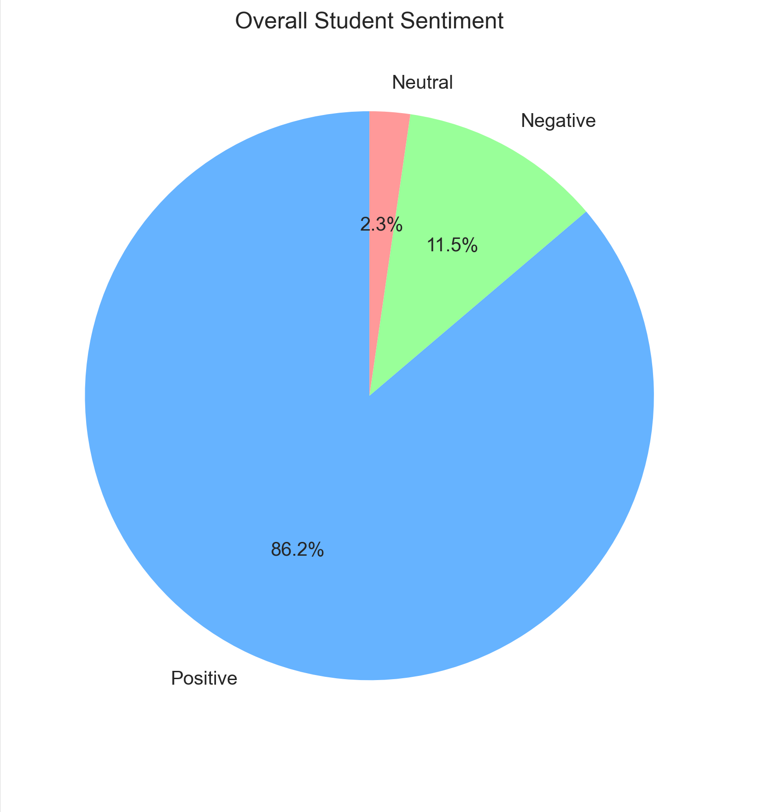
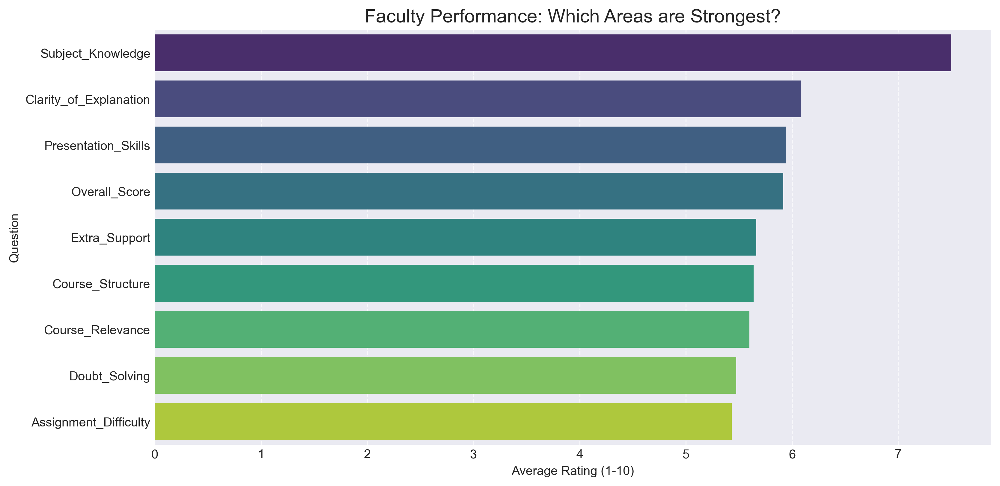
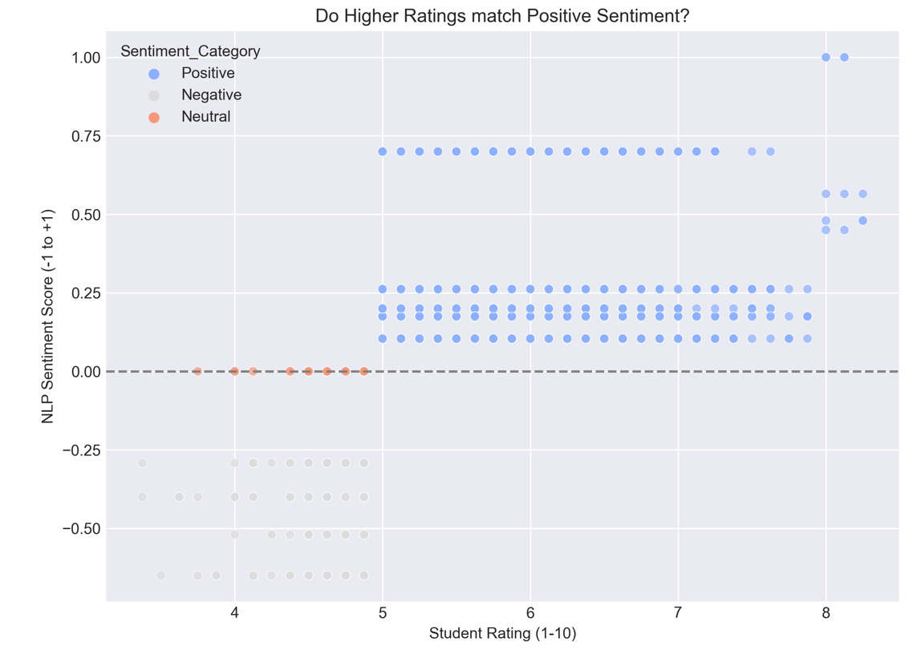

# 🎓 Student Feedback Analysis & Sentiment Insights


## 📝 Project Overview
This project involved analyzing student feedback collected from college events (Tech Fests, Workshops, Cultural Activities). The goal was to leverage **Natural Language Processing (NLP)** and data visualization to understand student satisfaction levels, identify key strengths and weaknesses in faculty performance, and provide actionable recommendations for future event improvements.

## 📂 Project Documentation & Code
*   **[📄 Download Full Project Report (PDF)](./Student-Feedback-Analysis%20Report.pdf)** - Detailed insights and visual analysis.
*   **[🐍 View Python Source Code (.ipynb)](./Student_Feedback_Analysis.ipynb)** - Interactive Jupyter Notebook.
  
## ❓ Task Objectives & Executive Questions
The analysis aimed to answer:
1.  **Overall Performance:** How satisfied are the students with college events/faculty?
2.  **Engagement Analysis:** Which aspects of the faculty/events receive the highest ratings?
3.  **Sentiment Analysis:** What is the underlying sentiment (positive/neutral/negative) in student comments?
4.  **Actionable Insights:** What specific improvements can be recommended for future events/faculty development?

## 🛠️ Data & Methodology
*   **Dataset:** Survey data from college events (ratings and text feedback), exported from Google Forms. (For demonstration, synthetic comments were generated based on ratings when original text was unavailable).
*   **Tools Used:**
    *   **Google Colab / Jupyter Notebook:** For code execution and environment.
    *   **Pandas:** Data loading, cleaning, and manipulation.
    *   **TextBlob:** NLP library for sentiment analysis (polarity scoring).
    *   **Seaborn/Matplotlib:** Data visualization.

## 📊 Key Findings & Visualizations

### 1. Overall Sentiment Distribution
**Executive Question:** How satisfied are students overall?
**Insight:** The sentiment analysis of student comments indicates a generally positive reception, with **86.2% of feedback being Positive**. However, the **11.5% Negative sentiment** highlights specific areas requiring immediate attention.

**Visual:**
<p align="center">
  
</p>
*(Pie chart showing Positive, Neutral, Negative sentiment breakdown)*

### 2. Faculty Performance Breakdown
**Executive Question:** Where does the faculty excel, and where do they struggle?
**Insight:** Faculty performance is strong in **Subject Knowledge** (highest average rating). However, areas related to **Doubt Solving** and **Assignment Difficulty** received the lowest scores, indicating student challenges in these aspects.

**Visual:**
<p align="center">
  
</p>
*(Bar chart showing average ratings for different faculty aspects)*

### 3. Sentiment vs. Rating Correlation
**Executive Question:** Does student sentiment align with their numerical ratings?
**Insight:** A strong positive correlation was observed between high numerical ratings and positive sentiment scores. Conversely, low ratings frequently corresponded with negative sentiment in the comments. This validates the feedback data's consistency.

**Visual:**
<p align="center">
  
</p>
*(Scatter plot of Average Rating vs. Sentiment Score)*

---

## 💡 Strategic Recommendations

*   **Enhance Student Support:** Address the low scores in **Doubt Solving** and **Assignment Difficulty** by implementing dedicated Q&A sessions or peer-support programs.
*   **Leverage Strengths:** Capitalize on the faculty's strong **Subject Knowledge** by creating mentorship programs or knowledge-sharing sessions among faculty members.
*   **Refine Feedback Process:** While sentiment analysis was performed on simulated data, integrating real text feedback mechanisms is crucial for future continuous improvement.

---

## 🚀 How to Run This Project
1.  Clone this repository.
2.  Ensure you have the necessary libraries installed:
    ```bash
    pip install pandas seaborn matplotlib textblob
    python -m textblob.download_corpora
    ```
3.  Open the `Student_Feedback_Analysis.ipynb` notebook in Jupyter or Google Colab.
4.  Run all cells sequentially to generate the analysis and visualizations.

---
*Created by B Kamachari | Data Analytics Internship Task 3*
